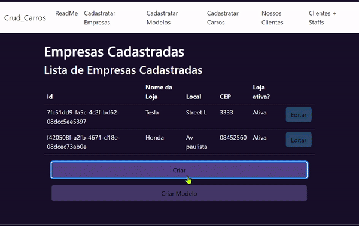

  

<h1 align="center">
  
</h1>

Este projeto é uma aplicação CRUD (Create, Read, Update, Delete) desenvolvida utilizando **.NET 8** e **Entity Framework Core** com **SQL Server**. A aplicação implementa o padrão de repositório (Repository Pattern), promovendo um código mais limpo e desacoplado.

## Tecnologias Utilizadas

- **.NET 8**
- **C#**
- **Entity Framework Core**
- **SQL Server**
- **Repository Pattern**
- **ASP.NET Core**
- **Bootstrap 5**
- **CSHTML**

## Funcionalidades

- **API RESTful** para operações de CRUD em entidades como Staff, Clientes, Modelos de Carros e Carros.
- **Padrão Repository** para isolar a lógica de acesso aos dados e as operações de CRUD das camadas superiores.
- **Relações Muitos-para-Muitos:** Entre Staff e Clientes utilizando a entidade de junção `ClientOfStaff`.
- **Relações Poucos-para-Poucos:** Entre Modelos de Carros e seus Donos, onde um Dono é um Cliente de uma Empresa.
- **Autenticação e Autorização:** Integrado com Identity para gerenciar autenticação e controle de acesso.
- **Documentação da API:** Utiliza Swagger para geração automática da documentação.

## Estrutura do Projeto

### Entidades

- **User**
- **Login**
- **Staff**
- **Client**
- **ModelOfCar**
- **Car**
- **ClientOfStaff**

### Repositórios

O projeto implementa o padrão Repository para facilitar o gerenciamento de dados e promover um código mais desacoplado:

- **IRepository<T>**: Interface genérica que define operações CRUD básicas.
- **StaffRepository, ClientRepository, CarRepository**, etc: Repositórios específicos que implementam a lógica de acesso ao banco de dados.

### Data

- **ApplicationDbContext:** Classe de contexto do Entity Framework Core, responsável pela comunicação com o banco de dados SQL Server e mapeamento das entidades.
  
### Endpoints

A aplicação possui endpoints para realizar operações de CRUD nas diferentes entidades, como:

- `GET /api/staff`
- `POST /api/staff`
- `PUT /api/staff/{id}`
- `DELETE /api/staff/{id}`

### Relações Entre Entidades

- **Staff gerencia Modelos de Carros.**
- **Modelos de Carros possuem um Dono.**
- **O Dono é um Cliente de uma Empresa.**
- **Clientes e Staff possuem uma relação muitos-para-muitos.**

<h1 align="center">

</h1>
